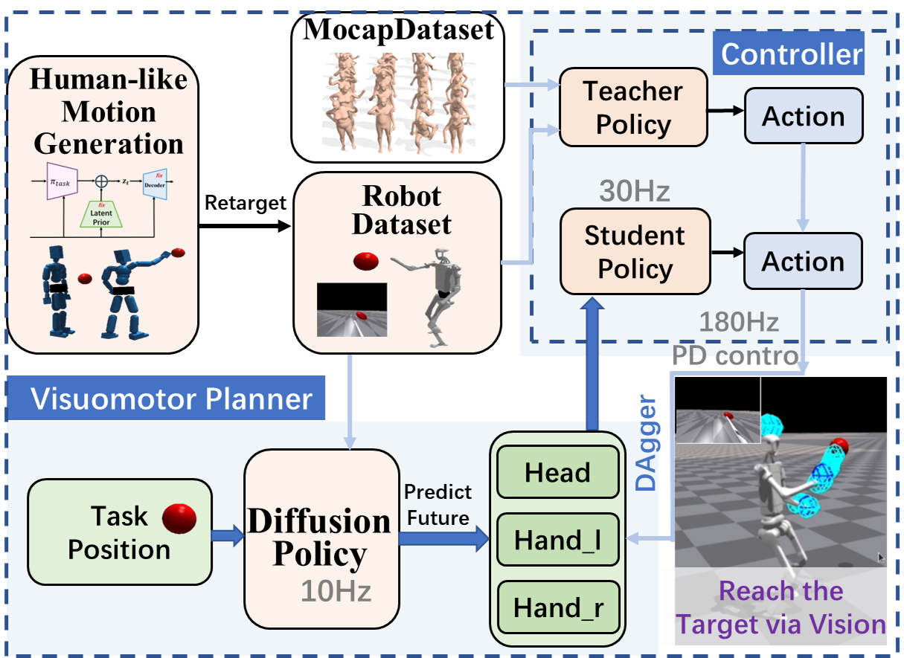

# RCar · Humanoid Reaching with Guided Diffusion Planning

**A Hierarchical Architecture for Humanoid Hand Reaching with Guided Diffusion Planning**

本科毕设：**基于扩散策略与模仿学习的人形机器人运动规划与控制方法研究**。

> **Public project showcase.** 论文、图片和演示视频现已公开；研究实现代码暂未发布。

[论文稿](https://anonnyyy.github.io/projects/rcar-humanoid-reaching/paper/rcar.pdf) · [仿真演示](https://anonnyyy.github.io/projects/rcar-humanoid-reaching/#video) · [网页文件](https://anonnyyy.github.io/projects/rcar-humanoid-reaching/) · [来源说明](SOURCE_NOTES.md)

将物理运动先验、目标重标注、引导扩散规划和教师–学生跟踪整合为闭环人形机器人到达系统。扩散模型预测头部与双手的稀疏未来轨迹，全身跟踪器将其转化为关节控制。

## Method

- **数据：** PULSE 运动先验、运动重定向、时间滤波和 HER 风格目标重标注；280 个动作片段、50,410 帧。
- **规划：** 引导扩散去噪，约束轨迹平滑性与初始状态一致性；噪声增强与 DAgger 风格修正改善鲁棒性。
- **执行：** 约 10 Hz 规划、30 Hz 学生跟踪和 180 Hz PD 控制。

## Results

以下均为 **Unitree H1 / Isaac Gym 仿真**，摘自 RCAR 论文稿 Table I。

| 图像输入设置 | 目标 | 成功率 | 最终到达误差 |
| --- | --- | ---: | ---: |
| 无 DAgger | 已见 | 77.78% | 0.1630 m |
| 一轮 DAgger | 已见 | **88.89%** | **0.0670 m** |
| 无 DAgger | 未见 | 60.00% | 0.1465 m |
| 一轮 DAgger | 未见 | **72.72%** | **0.1338 m** |

完整视觉任务的成功率与单独跟踪器实验的成功率分开报告。论文稿不在本页标注为已录用或已发表。

## Viewing the page

下载仓库后用浏览器打开 `index.html`，即可查看完整排版、播放视频和放大图片。页面和媒体均已公开。研究实现代码暂未发布；在线浏览：https://anonnyyy.github.io/projects/rcar-humanoid-reaching/
